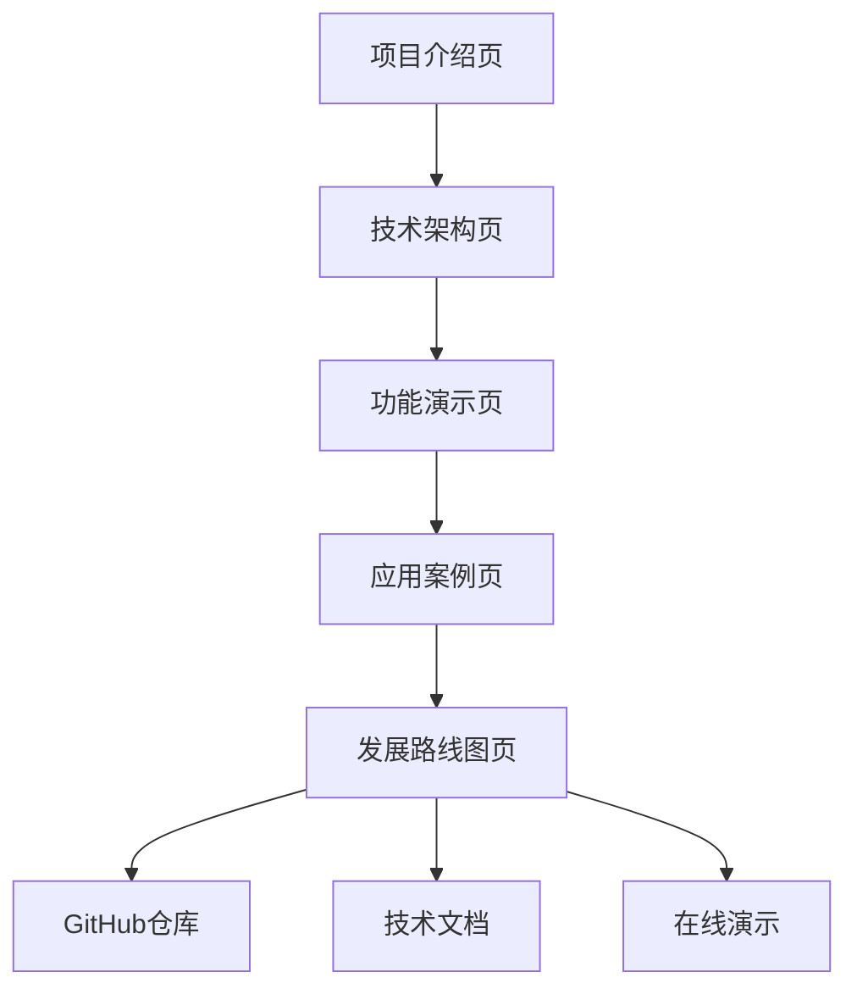

## 1. 产品概述
JSAR（JavaScript Augmented Reality）是一个专为空间网络（Spatial Web）设计的开源浏览器引擎。它让Web开发者能够使用熟悉的HTML5、CSS3和TypeScript技术创建沉浸式3D体验，将VR、AR和MR无缝融合到物理世界和数字虚拟环境中。

该项目解决了传统2D浏览器无法有效处理3D空间内容的问题，为空间计算时代提供了全新的Web浏览解决方案。

## 2. 核心功能

### 2.1 用户角色
| 角色 | 注册方式 | 核心权限 |
|------|----------|----------|
| Web开发者 | 开源社区参与 | 使用JSAR引擎开发空间Web应用 |
| 3D内容创作者 | GitHub访问 | 创建和发布3D空间内容 |
| XR开发者 | 技术文档学习 | 集成WebXR和混合现实体验 |
| 企业用户 | 商业合作 | 在Unity/Unreal项目中集成JSAR |

### 2.2 功能模块
我们的在线Slides展示包含以下主要页面：
1. **项目介绍页**：JSAR背景、愿景和核心价值主张
2. **技术架构页**：引擎架构、渲染管线和核心组件
3. **功能演示页**：空间化DOM、WebXR支持和立体渲染
4. **应用案例页**：Unity集成、立体图像和实际应用场景
5. **发展路线图页**：当前进展、未来规划和社区生态

### 2.3 页面详情
| 页面名称 | 模块名称 | 功能描述 |
|----------|----------|----------|
| 项目介绍页 | 英雄区域 | 展示JSAR标志和"空间网络浏览器引擎"核心定位 |
| 项目介绍页 | 问题陈述 | 说明传统2D浏览器在空间计算时代的局限性 |
| 项目介绍页 | 解决方案 | 展示JSAR如何通过3D优先设计解决空间Web需求 |
| 技术架构页 | 架构概览 | 显示引擎核心组件和数据流图 |
| 技术架构页 | 渲染管线 | 展示空间化DOM到GPU的高效渲染流程 |
| 技术架构页 | 平台支持 | 列出支持的渲染后端和目标平台 |
| 功能演示页 | 空间化DOM | 演示HTML元素在3D空间中的真实坐标定位 |
| 功能演示页 | WebXR集成 | 展示VR/AR设备支持和交互能力 |
| 功能演示页 | 立体渲染 | 演示立体图像的左右眼分离渲染 |
| 应用案例页 | Unity集成 | 展示作为库集成到Unity项目的示例 |
| 应用案例页 | 立体图像 | 演示spatial="stereo"属性的实际应用 |
| 应用案例页 | 空间GUI | 展示使用HTML/CSS创建3D用户界面 |
| 发展路线图页 | 当前状态 | 显示已完成的Web标准和平台支持 |
| 发展路线图页 | 未来规划 | 展示WebGPU、Unreal集成等计划功能 |
| 发展路线图页 | 社区生态 | 显示开源贡献、文档和工具链建设 |

## 3. 核心流程
用户浏览Slides的主要流程：

**普通用户流程**：
1. 进入首页，了解JSAR基本概念和价值主张
2. 浏览技术架构，理解引擎工作原理
3. 观看功能演示，体验空间Web的独特能力
4. 查看应用案例，了解实际使用场景
5. 查看发展路线图，了解项目进展和未来方向

**技术开发者流程**：
1. 深入了解技术架构和实现细节
2. 研究功能演示的代码示例和技术原理
3. 查看GitHub仓库和文档链接
4. 评估集成到现有项目的可能性

## 4. 用户界面设计

### 4.1 设计风格
- **主色调**：深蓝色渐变（#667eea到#764ba2），体现科技感和专业性
- **辅助色**：白色和浅灰色，确保内容清晰可读
- **按钮样式**：圆角矩形，现代化设计风格
- **字体选择**：Arial无衬线字体，确保跨平台一致性
- **布局风格**：卡片式布局，每个Slides页面独立成块
- **图标风格**：使用3D和空间相关的emoji和图标

### 4.2 页面设计概览
| 页面名称 | 模块名称 | UI元素 |
|----------|----------|--------|
| 项目介绍页 | 英雄区域 | 全屏渐变背景，居中显示JSAR标志和核心标语 |
| 项目介绍页 | 内容区域 | 左右分栏布局，左侧文字说明，右侧示意图 |
| 技术架构页 | 架构图 | 居中显示Mermaid架构流程图 |
| 技术架构页 | 技术栈 | 网格布局展示支持的技术标准 |
| 功能演示页 | 代码示例 | 语法高亮的HTML代码片段 |
| 功能演示页 | 效果展示 | 3D空间示意图和渲染效果对比 |
| 应用案例页 | 案例卡片 | 网格布局展示不同应用场景 |
| 发展路线图页 | 时间线 | 垂直时间线显示项目里程碑 |

### 4.3 响应式设计
- **桌面优先**：针对大屏幕优化，充分利用空间展示复杂架构图
- **移动端适配**：支持触摸滑动切换Slides，内容自动调整布局
- **交互优化**：支持键盘方向键导航，鼠标滚轮切换

### 4.4 3D场景指导
由于JSAR本身就是3D浏览器引擎，Slides中需要展示3D概念：
- **环境设置**：使用现代简洁的3D空间背景
- **光照效果**：柔和的环境光和点光源，突出重要元素
- **相机控制**：平滑的过渡动画，模拟空间中的移动
- **交互元素**：悬停效果、点击反馈和过渡动画
- **性能优化**：控制3D元素数量，确保流畅的演示体验