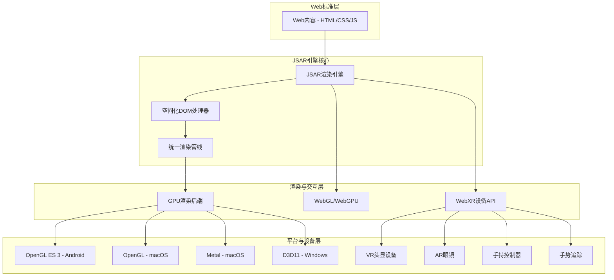
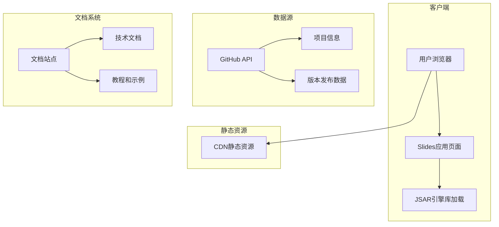

## 1. 架构设计

JSAR作为空间网络浏览器引擎，采用分层架构设计，支持Web标准与3D空间渲染的无缝集成。



## 2. 技术描述

### 核心技术栈
- **引擎核心**: Rust + C/C++ (高性能浏览器引擎实现)
- **Web标准**: HTML5子集、CSS3部分支持、完整DOM API
- **3D图形**: WebGL 1.0/2.0完整支持、WebGPU开发中
- **空间计算**: WebXR设备API完整实现
- **脚本支持**: JavaScript ES2023、TypeScript原生编译
- **模块系统**: ECMAScript模块、WebAssembly、Web Worker

### 平台支持
- **移动端**: Android (OpenGL ES 3)
- **桌面端**: macOS (OpenGL/Metal)、Windows (D3D11)
- **XR设备**: 支持主流VR/AR头显设备
- **集成方式**: Unity插件可用、Unreal Engine计划中

## 3. 路由定义

在线Slides应用的前端路由设计：

| 路由 | 目的 |
|------|------|
| / | 项目介绍首页，展示JSAR核心概念和价值主张 |
| /architecture | 技术架构页面，详细展示引擎架构和渲染管线 |
| /features | 功能演示页面，展示空间化DOM、WebXR等核心功能 |
| /use-cases | 应用案例页面，展示Unity集成和实际应用场景 |
| /roadmap | 发展路线图页面，显示项目进展和未来规划 |
| /demo | 在线演示页面，提供交互式体验 |
| /docs | 技术文档链接，跳转到官方文档站点 |

## 4. API定义

### 4.1 空间化DOM API

JSAR扩展了标准DOM API，为HTML元素添加空间属性：

```typescript
interface SpatialElement extends HTMLElement {
    // 3D变换属性
    spatialPosition: { x: number; y: number; z: number };
    spatialRotation: { x: number; y: number; z: number };
    spatialScale: { x: number; y: number; z: number };
    
    // 空间层属性
    spatialLayer: number;
    spatialStereo?: boolean;
}

// 使用示例
const element = document.getElementById('spatial-div') as SpatialElement;
element.spatialPosition = { x: 2.0, y: 1.5, z: -3.0 };
element.spatialRotation = { x: 0, y: 15, z: 0 };
```

### 4.2 WebXR集成API

```typescript
interface SpatialNavigator extends Navigator {
    gl: WebGL2RenderingContext;  // 直接WebGL上下文访问
}

// 初始化空间渲染
async function initSpatialRendering() {
    const navigator = window.navigator as SpatialNavigator;
    const gl = navigator.gl;
    
    // 无需canvas，直接渲染到空间环境
    const scene = new THREE.Scene();
    const camera = new THREE.PerspectiveCamera();
    
    // 渲染循环
    function render() {
        gl.clear(gl.COLOR_BUFFER_BIT | gl.DEPTH_BUFFER_BIT);
        // 自定义渲染逻辑
        requestAnimationFrame(render);
    }
    render();
}
```

### 4.3 立体图像API

```typescript
interface StereoImageElement extends HTMLImageElement {
    spatial: 'stereo' | 'mono';
}

// HTML使用
// 
```

## 5. 服务器架构

由于JSAR是客户端浏览器引擎，主要架构在客户端实现。但在线Slides需要轻量级服务端支持：



## 6. 数据模型

### 6.1 项目元数据结构

```mermaid
erDiagram
    PROJECT ||--o{ RELEASE : has
    PROJECT ||--o{ FEATURE : contains
    PROJECT ||--o{ PLATFORM : supports
    
    PROJECT {
        string name "JSAR"
        string version
        string description "Spatial Web Browser Engine"
        string github_url
        string docs_url
        string status "active"
    }
    
    RELEASE {
        string version PK
        date release_date
        string changelog
        boolean is_stable
    }
    
    FEATURE {
        string name PK
        string category
        string status "completed|in_progress|planned"
        string description
    }
    
    PLATFORM {
        string name PK
        string backend
        string status "supported|planned"
        string requirements
    }
}
```

### 6.2 功能状态数据

```sql
-- 功能特性表
CREATE TABLE features (
    id INTEGER PRIMARY KEY,
    name VARCHAR(100) NOT NULL,
    category VARCHAR(50) NOT NULL,
    status VARCHAR(20) CHECK (status IN ('completed', 'in_progress', 'planned')),
    description TEXT,
    version_added VARCHAR(20),
    documentation_url VARCHAR(255)
);

-- 插入核心功能数据
INSERT INTO features (name, category, status, description, version_added) VALUES
('WebGL 1.0', '3D Graphics', 'completed', 'Complete WebGL 1.0 implementation', 'v0.1.0'),
('WebGL 2.0', '3D Graphics', 'completed', 'Complete WebGL 2.0 implementation', 'v0.5.0'),
('WebXR Device API', 'XR Support', 'completed', 'Full WebXR spaces and input support', 'v0.8.0'),
('Stereo Rendering', 'XR Support', 'completed', 'Optimized dual-eye rendering', 'v0.9.0'),
('Spatial DOM', 'Core Engine', 'completed', '3D spatial properties for HTML elements', 'v0.7.0'),
('Unity Integration', 'Platform', 'completed', 'Unity plugin for JSAR integration', 'v0.8.0'),
('WebGPU', '3D Graphics', 'planned', 'Next-generation graphics API support', 'v0.12.0'),
('Unreal Integration', 'Platform', 'planned', 'Unreal Engine plugin', 'v0.11.0'),
('Hand Tracking', 'XR Support', 'completed', 'Precise gesture recognition', 'v0.9.0'),
('Custom Fonts', 'Typography', 'completed', 'System fonts directory support', 'v0.10.0');

-- 平台支持表
CREATE TABLE platform_support (
    id INTEGER PRIMARY KEY,
    platform VARCHAR(50) NOT NULL,
    backend VARCHAR(100),
    status VARCHAR(20) CHECK (status IN ('supported', 'planned', 'development')),
    version_added VARCHAR(20)
);

INSERT INTO platform_support (platform, backend, status, version_added) VALUES
('Android', 'OpenGL ES 3', 'supported', 'v0.6.0'),
('macOS', 'OpenGL', 'supported', 'v0.4.0'),
('macOS', 'Metal', 'planned', 'v0.11.0'),
('Windows', 'D3D11', 'planned', 'v0.12.0'),
('iOS', 'OpenGL ES 3', 'development', 'v0.11.0');
```

## 7. 性能优化策略

### 7.1 渲染优化
- **批次合并**: 将空间化HTML元素动态批处理为≤10个GPU绘制调用
- **立体渲染**: 优化的双眼渲染，重用GPU纹理减少开销
- **层级剔除**: 基于空间位置的智能渲染剔除

### 7.2 内存管理
- **纹理压缩**: 自动纹理压缩和格式优化
- **资源池**: GPU资源池化管理，减少分配开销
- **垃圾回收**: 智能内存回收机制

### 7.3 跨平台兼容性
- **着色器编译**: 自动适配不同GPU架构
- **分辨率缩放**: 动态分辨率调整适应设备性能
- **帧率自适应**: 根据设备性能动态调整渲染质量