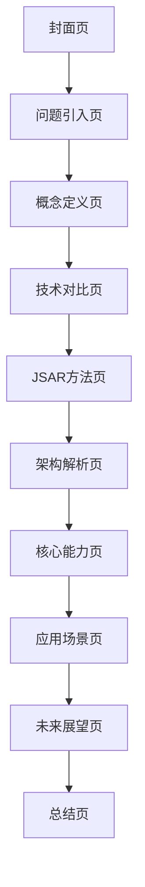

## 1. 产品概述
Spatial Web Browser Engine（JSAR）PPT演示文档，用于向技术受众和开发者介绍空间网络浏览器引擎的核心概念、技术架构和应用价值。通过一页页的PPT形式，深入解析什么是Spatial Web Browser Engine，以及它如何重新定义网络浏览体验。

目标受众：Web开发者、技术决策者、AR/VR从业者、产品经理
核心价值：展示JSAR如何通过空间计算技术，将传统2D网页转化为沉浸式3D体验

## 2. 核心功能

### 2.1 用户角色
| 角色 | 获取方式 | 核心权限 |
|------|----------|----------|
| 技术观众 | 公开访问 | 浏览PPT内容，了解技术概念 |
| 开发者 | 公开访问 | 学习技术实现，获取开发指导 |
| 企业决策者 | 公开访问 | 评估技术价值，制定战略决策 |

### 2.2 功能模块
PPT演示包含以下核心页面：
1. **封面页**：项目标题和核心标语
2. **问题引入页**：传统浏览器的局限性
3. **概念定义页**：什么是Spatial Web Browser Engine
4. **技术对比页**：为何不扩展传统浏览器
5. **JSAR方法页**：核心方法论介绍
6. **架构解析页**：技术架构详解
7. **核心能力页**：主要功能特性
8. **应用场景页**：实际应用案例
9. **未来展望页**：技术发展趋势
10. **总结页**：关键要点回顾

### 2.3 页面详情
| 页面名称 | 模块名称 | 功能描述 |
|----------|----------|----------|
| 封面页 | 标题展示 | 显示"Spatial Web Browser Engine"主标题和副标题，营造技术感视觉效果 |
| 问题引入页 | 痛点分析 | 展示传统2D浏览器在AR/VR时代的局限性，使用对比图表 |
| 概念定义页 | 核心定义 | 清晰定义Spatial Web Browser Engine，强调3D空间中的HTML元素概念 |
| 技术对比页 | 架构对比 | 对比传统浏览器扩展vs重新设计的架构差异 |
| JSAR方法页 | 方法论 | 介绍JSAR的独特方法：平台兼容性+空间现实假设 |
| 架构解析页 | 技术架构 | 详细解析JSAR的运行时架构和渲染管线 |
| 核心能力页 | 功能特性 | 展示mono/stereo渲染、WebXR支持、空间交互等核心能力 |
| 应用场景页 | 案例展示 | 展示多任务3D画布、数据可视化、沉浸式电商等应用场景 |
| 未来展望页 | 发展趋势 | 预测空间网络的未来发展方向和机遇 |
| 总结页 | 要点回顾 | 总结关键价值主张和技术优势 |

## 3. 核心流程

**观众浏览流程**：
封面页 → 问题引入 → 概念定义 → 技术对比 → JSAR方法 → 架构解析 → 核心能力 → 应用场景 → 未来展望 → 总结页

## 4. 用户界面设计

### 4.1 设计风格
- **主色调**：深蓝色（#1a1a2e）搭配科技蓝（#16213e）和亮蓝色（#0f4c75）
- **辅助色**：白色（#ffffff）和浅灰色（#f5f5f5）用于文字和背景
- **按钮样式**：扁平化设计，圆角矩形，悬停效果
- **字体选择**：中文使用思源黑体，英文使用Roboto，标题48-64px，正文24-32px
- **布局风格**：卡片式布局，每页聚焦一个核心概念，大量留白
- **图标风格**：线性图标，简洁现代，符合技术主题

### 4.2 页面设计概述
| 页面名称 | 模块名称 | UI元素 |
|----------|----------|--------|
| 封面页 | 标题展示 | 深蓝色渐变背景，白色大标题居中，副标题较小字号，科技感粒子动画效果 |
| 问题引入页 | 痛点分析 | 左右分栏布局，左侧文字描述，右侧2D vs 3D对比示意图，使用渐变色彩 |
| 概念定义页 | 核心定义 | 中央放置3D空间中的HTML元素概念图，周围环绕关键词标签 |
| 技术对比页 | 架构对比 | 表格对比形式，传统浏览器架构 vs JSAR架构，使用不同颜色区分 |
| JSAR方法页 | 方法论 | 双圆形图表展示平台兼容性和空间现实假设两大核心方法 |
| 架构解析页 | 技术架构 | 分层架构图，使用不同颜色区块表示各层，添加箭头指示数据流 |
| 核心能力页 | 功能特性 | 网格布局展示4-6个核心能力，每个能力配图标和简短描述 |
| 应用场景页 | 案例展示 | 三栏网格展示不同应用场景，每栏包含场景图和描述文字 |
| 未来展望页 | 发展趋势 | 时间轴设计，展示技术发展的阶段性目标和里程碑 |
| 总结页 | 要点回顾 | 中心聚合式布局，核心要点围绕中心图标排列 |

### 4.3 响应式设计
- **桌面优先**：基于1920x1080分辨率设计，支持大屏幕投影
- **移动端适配**：支持平板设备浏览，优化触摸交互
- **演示模式**：支持全屏演示，提供演讲者笔记功能

### 4.4 动画效果
- **页面切换**：使用平滑的淡入淡出效果，过渡时间0.5秒
- **元素动画**：关键概念使用渐显动画，增强记忆效果
- **交互反馈**：按钮悬停时有缩放效果，点击有反馈动画