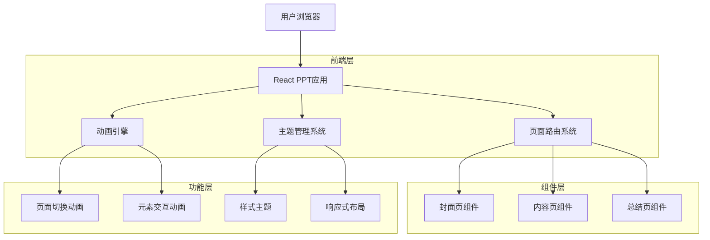
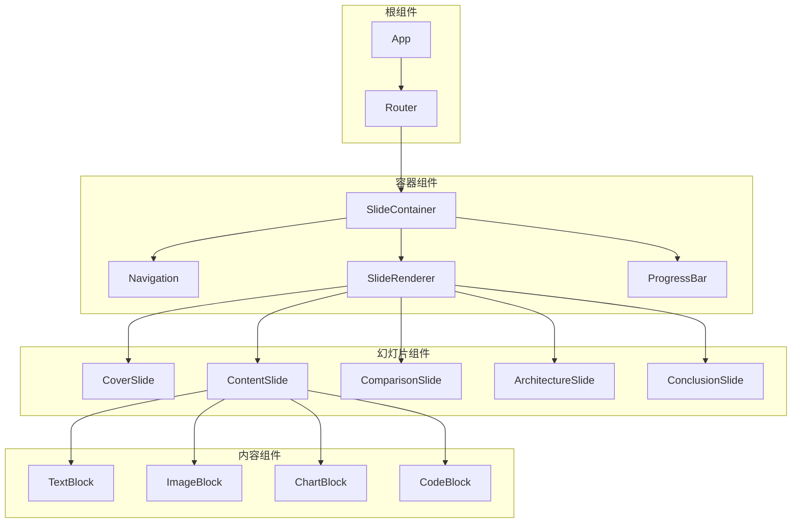
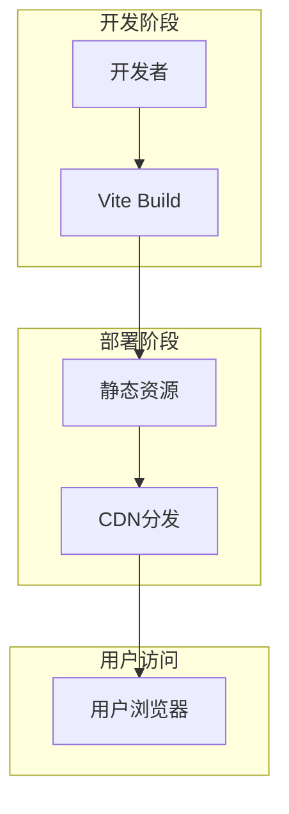

## 1. 架构设计



## 2. 技术描述

- **前端框架**：React@18 + TypeScript@5 + Vite@5
- **初始化工具**：vite-init
- **样式方案**：Tailwind CSS@3 + Framer Motion@11（动画）
- **路由管理**：React Router@6
- **状态管理**：React Context + useReducer
- **图标库**：Lucide React@0.400+
- **代码高亮**：Prism React Renderer@2
- **3D渲染**：Three.js@0.160 + @react-three/fiber@8（用于概念展示）
- **后端服务**：无（纯前端静态应用）

## 3. 路由定义

| 路由 | 用途 |
|------|------|
| / | 封面页，展示项目标题和核心标语 |
| /slide-1 | 问题引入页，传统浏览器的局限性 |
| /slide-2 | 概念定义页，什么是Spatial Web Browser Engine |
| /slide-3 | 技术对比页，为何不扩展传统浏览器 |
| /slide-4 | JSAR方法页，核心方法论介绍 |
| /slide-5 | 架构解析页，技术架构详解 |
| /slide-6 | 核心能力页，主要功能特性 |
| /slide-7 | 应用场景页，实际应用案例 |
| /slide-8 | 未来展望页，技术发展趋势 |
| /slide-9 | 总结页，关键要点回顾 |

## 4. 核心组件架构

### 4.1 页面布局组件
```typescript
interface SlideLayoutProps {
  slideNumber: number;
  title: string;
  children: ReactNode;
  animationType?: 'fade' | 'slide' | 'zoom';
}

const SlideLayout: React.FC<SlideLayoutProps> = ({ 
  slideNumber, 
  title, 
  children, 
  animationType = 'fade' 
}) => {
  // 通用幻灯片布局逻辑
};
```

### 4.2 动画系统
```typescript
interface AnimationConfig {
  duration: number;
  easing: string;
  delay?: number;
}

const pageTransitions = {
  fade: {
    initial: { opacity: 0 },
    animate: { opacity: 1 },
    exit: { opacity: 0 }
  },
  slide: {
    initial: { x: 100, opacity: 0 },
    animate: { x: 0, opacity: 1 },
    exit: { x: -100, opacity: 0 }
  }
};
```

### 4.3 主题系统
```typescript
interface ThemeConfig {
  colors: {
    primary: string;
    secondary: string;
    accent: string;
    background: string;
    text: string;
  };
  fonts: {
    heading: string;
    body: string;
  };
  spacing: {
    small: string;
    medium: string;
    large: string;
  };
}
```

## 5. 组件层次结构



## 6. 性能优化策略

### 6.1 代码分割
- 按路由进行代码分割
- 懒加载非关键组件
- 预加载下一张幻灯片资源

### 6.2 图片优化
- 使用WebP格式
- 响应式图片加载
- 懒加载屏幕外图片

### 6.3 动画优化
- 使用CSS transform代替position变化
- 启用硬件加速
- 避免强制同步布局

## 7. 部署架构



### 7.1 构建流程
1. TypeScript编译检查
2. React组件打包优化
3. 样式文件压缩
4. 图片资源优化
5. 生成source map

### 7.2 部署选项
- **GitHub Pages**：免费托管，适合开源项目
- **Vercel**：自动部署，支持预览
- **Netlify**：拖拽部署，表单功能
- **阿里云OSS**：国内访问优化

## 8. 浏览器兼容性

| 浏览器 | 最低版本 | 支持特性 |
|--------|----------|----------|
| Chrome | 88+ | 全部特性 |
| Firefox | 85+ | 全部特性 |
| Safari | 14+ | 基本特性 |
| Edge | 88+ | 全部特性 |

### 8.1 Polyfill策略
- 核心JS特性：core-js
- WebGL支持：three.js回退方案
- CSS特性：PostCSS自动添加前缀

## 9. 开发工具链

### 9.1 代码质量
- ESLint：代码规范检查
- Prettier：代码格式化
- TypeScript：类型检查
- Husky：Git钩子管理

### 9.2 开发效率
- Vite HMR：热模块替换
- React DevTools：组件调试
- Chrome DevTools：性能分析
- VS Code插件：智能提示